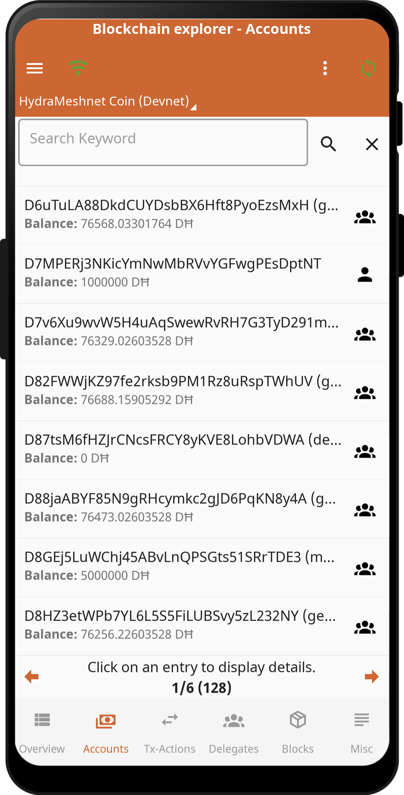

# ĦWallet

The world's first & only blackout-resilient cryptocurrency wallet, that can run in a self-sufficient radio meshnet. The ĦWallet will soon offer Blackout-resilience as a Service (BaaS) (with our ĦMESH utility coin as fee) for other blockchain ecosystems such as Bitcoin, Ethereum, Cosmos, etc. in order to make these cryptocurrencies usable in crisis areas for the first time. The ĦWallet currently hosts the Pre-sale of our HMESH ERC20 token and will soon be hosting the ĦShop for our hardware products, the trustless ĦBridge between our native ĦMESH DPoS-Blockchain and the HMESH ERC20 token on Arbitrum. After the pre-sale it will also host the IDO for the HMESH-DEX, the voting and staking opportunity in our DPoS ecosystem and the much anticipated Oneway Swap (OWS) into the Free World Dollar (FWD).

  
  
  

## Current status
This is currently a MVP.

All core features are implemented and working.

There will be further improvements and functional enhancements in the future.

## Apps/Features (Overview)

## Installation

### Android
Tested with the following Android versions:
- Android 7, 8, 9, 10, 11, 12, 13, 14, 15

Tested with the following hardware:
- Google
- Samsung
- Realme C21-Y
- Ulefone Armor 7

For your Android devices, download the APK and allow the installation.

## Copyright

Copyright (c) 2025 HydraMeshnet / hydramesh.net
All Rights Reserved.

This software is licensed under the "HydraMeshnet License", available at:
[End User License Agreement (EULA)](./EULA.md)

Unauthorized use, reproduction, or distribution of this software is prohibited.

By using this software, you agree to the terms outlined in the End User License Agreement (EULA).

For full license information, refer to: [End User License Agreement (EULA)](./EULA.md)

## Legal

- [End User License Agreement (EULA)](./EULA.md)
- [Privacy Policy](./PRIVACY.md)
