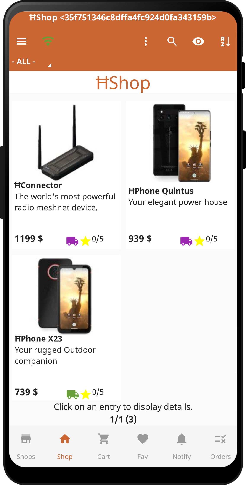

# ĦWallet

The world's first & only blackout-resilient cryptocurrency wallet, that can run in an energy-autonomous radio meshnet. The ĦWallet will soon offer Blackout-Resilience as a Service (BRaaS) (with our ĦMESH utility coin as fee) for other blockchain ecosystems such as Bitcoin, Ethereum, USD-stablecoins, ERC20 token, etc. in order to make these cryptocurrencies usable in crisis areas with power outages for the first time. The ĦWallet already hosts the Presale of our HMESH ERC20 token and the ĦShop for our hardware products. In the future it will also host the HMESH DEX, after being implemented on our own ĦMESH-L1. 

  
  
  

## Current status
This is currently a minimal viable product (MVP).

All core features are implemented and working.

There will be continous improvements and functional enhancements in future updates.

## Getting Started
Download the APK file from the current [Releases](https://github.com/HydraMeshnet/HWallet/releases) and install it.

## Apps/Features (Overview)
- **Decentralized mesh network:** Don't rely on central providers. Become your own network operator in your region.
- **Various connection types:** Unstoppable trade anywhere and anytime
  Use ĦConnector LoRaPay or ĦConenctor Maxi for long distances, Bluetooth to those around you, WiFi at home or on the road, ĦVPN over any available internet connection, any other interface which Reticulum supports.
- **Secure transport encryption:** Asymmetric X25519 encryption and Ed25519 signatures.
- **Keep your account:** Your account identity and keys are stored locally and encrypted with your seed phrase.
- **Wallet:** Crypto wallet to send/receive crypto currencies.
- **ĦShop:** Integrated shop for purchasing our products.
- **Integrated QR code system:** Share your account or payments with others via QR codes.
- **Backup/Restore:** Automatic backup, export, and import of your account. Migrate to a new device.
- **Multilingual and multiple UI modes:** Internationally usable, suitable for beginners and professionals.
- **Highly customizable:** Change UI and behavior.
- ...

## Connection types
- **ĦVPN:** Use any internet connection such as WiFi, 4G/5G. Stay private and anonymous by using ĦVPN.
- **WiFi/WLAN:** Use any WiFi network for direct communication between the devices. For example, a public hotspot, your home network, or a smartphone hotspot.
- **Bluetooth:** Use a direct connection between the smartphones. They must be paired first.
- **Bluetooth LE:** Use a direct connection between the smartphones. Automatic connection and building of the mesh. (IN DEVELOPMENT)
- **ĦConnector LoRaPay:** Affordable entry-level radio module for middle range with very low data rates. Only usable for payments and short emergency messages. Recommended for user access or one hop to bridge a gap to users.
- **ĦConnector Maxi:** High-end radio module for long range with high data rates. Recommended for buidling the "core/backbone" mesh network.
- **Any other interface Reticulum supports:** Such as TCP Client/Server, UDP Client/Server, Radio modem, Serial, I2P, ...

## Apps/Features (Details)
- **Archive:** Archive elements. This can be used to archive elements that are no longer needed before they are finally deleted.
- **Backup/Restore:** Backup all data/configuration of the app. The backup can be automated. There are various settings for this in basic settings. In addition, a manual backup can be performed. The data can then be restored on the same or a new device.
- **Help:** In the app integrated help for all important functions.
- **QR code export:** Integrated QR code generator for displaying/exporting elements as qr codes. The QR code can be scanned with the integrated scanner or the camera app of your device.
- **QR code scanner:** Integrated QR code scanner for reading elements or any other qr codes.
- **ĦShop:** Integrated shop for purchasing our products.
- **Wallet:** Crypto wallet to send/receive crypto currencies. This can be used to pay directly in the shop or send money to another user.
- **Wallet Explorer:** Crypto wallet explorer to view all accounts/transactions on the blockchain. This can be used to check the accounts of other users or to verify own accounts/transactions.
- **Wallet Sale:** Buy crypto tokens.

## Installation

### Android
For your Android devices, download the APK and allow the installation.

## Copyright

Copyright (c) 2026 HydraMeshnet / hydramesh.net
All Rights Reserved.

This software is licensed under the "HydraMeshnet License", available at:
[End User License Agreement (EULA)](./EULA.md)

Unauthorized use, reproduction, or distribution of this software is prohibited.

By using this software, you agree to the terms outlined in the End User License Agreement (EULA).

For full license information, refer to: [End User License Agreement (EULA)](./EULA.md)

## Legal

- [End User License Agreement (EULA)](./EULA.md)
- [Privacy Policy](./PRIVACY.md)
